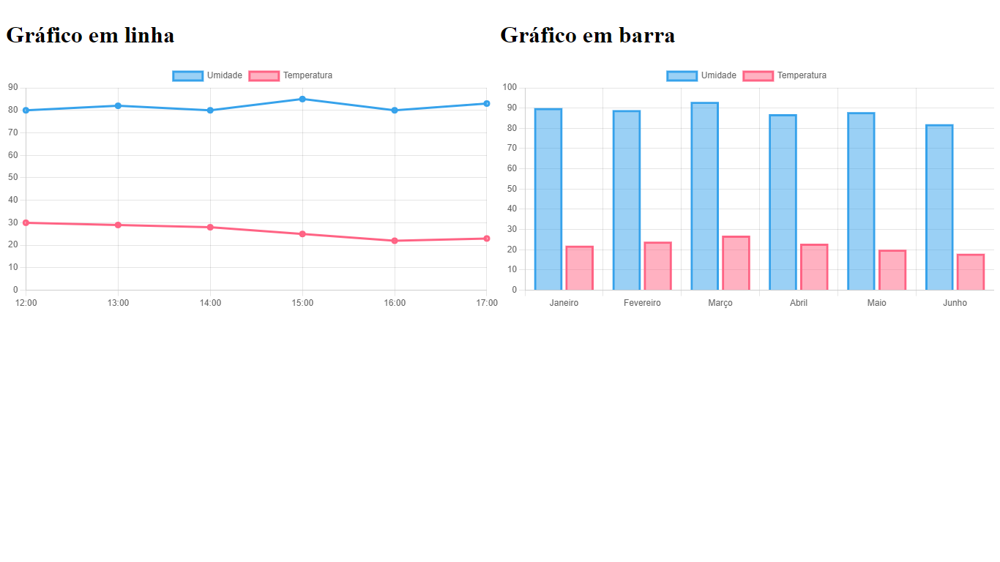

<h1 align="center"> ChartJS </h1>

Atividade sobre criação de gráficos  

  

 

  <h3 align='center'>Web</h3>
  

## ✅ Status

 - Em produção ✅

## 👨🏼‍💻 Funções

 - Manipulação de dados
 - Estilização dos gráficos

## 🚀 Tecnologias

Esse projeto foi desenvolvido com as seguintes tecnologias:

- HTML
- CSS
- Javascript
- ChartJS

## 💻 Projeto

Este projeto é a atividade para darmos início as dashboard para a nossa Sprint 2

## :memo: Licença

Esse projeto está sob a licença MIT.
